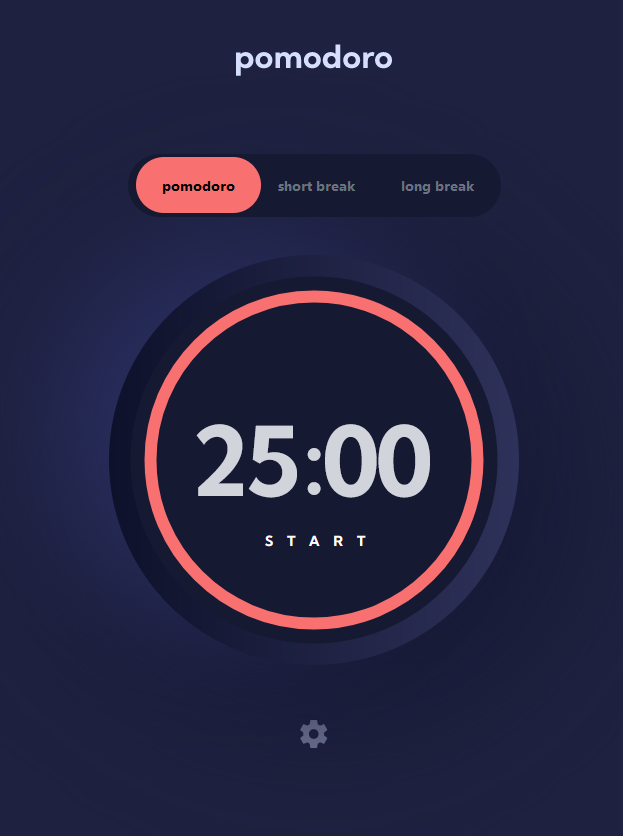
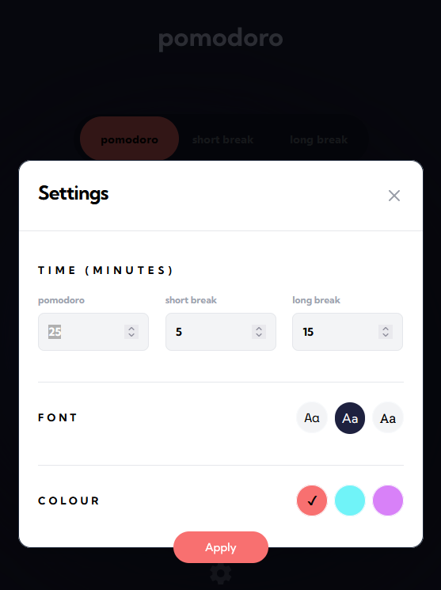

# Pomodoro app - a time management application based on the pomodoro technique.

<p align="center">




</p>

**Pomodoro app** is a group project application with a fully functional timer that follows the pomodoro technique at its core.

## Technologies used
* [Next.js](https://nextjs.org/) Modern React based framework
* [tailwindcss](https://tailwindcss.com/) Styling framework
* [shadcn/ui](https://ui.shadcn.com/) Re-usable beautifully designed components
* [Redux](https://redux.js.org/) State management


# Setup locally

**Install dependencies**
```
yarn install
```

**Run the dev environment**
```
yarn dev
```


## Contributing

If you would like to contribute to this project:
* please fork and clone the repo locally
* Create an "issue" to describe what you want to work on
* Submit a pull request.

Thank you very much!


## Authors

* [Evan Trujillo](https://github.com/evomatic)
* [Robert Kirkman](https://github.com/blue2wo)
